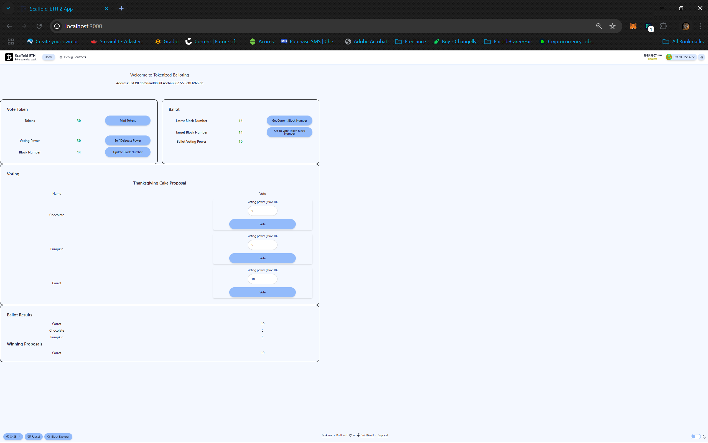

# Tokenized Votes Full Stack
Explore tokenized ballot where voters need to own
voting tokens in order to have voting power.  Ballot
only considers votes made up to a specific point 
in the past.  

Two contracts are provided TokenizedBallot and VotingToken
Interactions happen via a Dapp(scaffold-eth-svelte) and a backend api (nestjs)

Try running some of the following tasks:

```shell
//install dependencies
//frontend/packages/hardhat
///frontend/packages/svelte
//frontend 
//backend
yarn install 

//ensure proper .env files in
//frontend/.env
//frontend/packages/hardhat/.env
//backend/.env
//.env.example files at each respective directories are provided on what is needed

#deploy tokenized voting token and ballot contracts
//frontend
yarn chain if using local chain
yarn deploy

#cp deployments to backend 
//from backend directory
cp ../frontend/packages/hardhat/deployments/[chain]/TokenizedVote.json src/assets/
cp ../frontend/packages/hardhat/deployments/[chain]/TokenizedBallot.json src/assets/

#start frontend and backend 
//backend 
yarn run start:dev
//frontend 
yarn start -> starts svelte frontend 

#for simplicity assuming hardhat environment as opposed to sepolia and metamask wallet 
#add deployer to wallet and use deployer account for operations 

#on frontend do the following

Vote Token screen
mintTokens
self delegate power
update block number

Ballot screen 
Set Vote Token Block Number 

This should update ballot voting power 

Voting screen
should show proposals
with updated ballot voting power

Ballot Results screen 
shows ballot results so far




